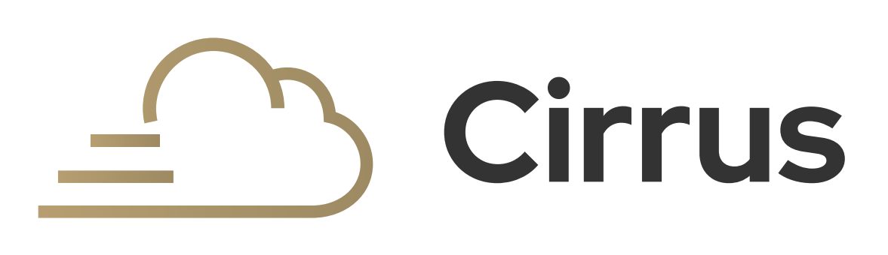

# Cirrus - Google Cloud Forensic Collection

## Overview

Cirrus is a command-line tool written in Python to facilitate environment access and evidence collection across 
Google Cloud. Cirrus has been designed to support incident response and threat hunting operations. Sygnia 
created Cirrus and an associated blog series ([Foundations](https://blog.sygnia.co/incident-response-in-google-cloud-foundations) 
& [Forensic Artifacts](https://blog.sygnia.co/incident-response-in-google-cloud-forensic-artifacts)) to help solve gaps
with incident response in Google Cloud.

Cirrus is composed of two scripts:

1. **Assistant**: automate Google Cloud access setup and cleanup 
2. **Collector**: collect log, configuration, and user data

The *Assistant* script is responsible for automating access prerequisites to 
a Google Cloud environment in preparation for evidence collection by the *Collector*. The Assistant script is 
built for execution in Google Cloud Shell, while the Collector script can be executed from any terminal. 

The *Collector* script utilizes a service account key file to authenticate to a Google Cloud environment, which can be generated through
the Assistant script or manual creation.

The collected forensic artifacts are captured in JSON format for easy ingestion with any log analysis platform (e.g., SIEM/SOAR).

## Capabilities

- **Aggregate logs and configurations** sourced from different Google Cloud components
- Significant insights to **improve security posture**
- Access **user-specific data**
- **Automate access prerequisites** in preparation for evidence collection
- **Intuitive and efficient** method of collecting specific or all available logs

The logs, configurations and data collected from Cirrus can be used for Incident Response, Threat Hunting and Posture!

### Assistant

To prepare a Google Cloud environment for evidence collection, reference [Assistant documentation](./Assistant/README.md).

### Collector

To collect evidence from Google Cloud, reference [Collector documentation](./Collectors/README.md).

## Demo

Link to Sygnia's webinar recording will be provided soon!
